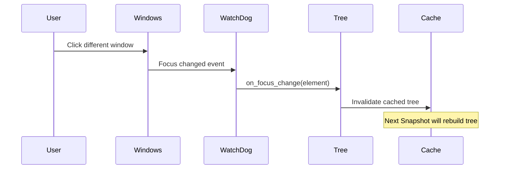

## Overview

The WatchDog service (`watchdog/service.py`) runs in a separate background thread, monitoring UI focus changes via UIAutomation events. When focus changes, it notifies the Tree Service to invalidate cached accessibility tree data, ensuring element discovery always reflects the current UI state.

## Purpose

<CardGroup cols={2}>
  <Card title="Focus Change Detection" icon="eye">
    Monitor when users or automation switch between windows
  </Card>
  <Card title="Cache Invalidation" icon="trash">
    Notify Tree Service to refresh element data when focus changes
  </Card>
  <Card title="Background Monitoring" icon="circle-dot">
    Run continuously in a separate thread without blocking automation
  </Card>
  <Card title="Event-Driven Updates" icon="bolt">
    React instantly to focus changes rather than polling
  </Card>
</CardGroup>

## Architecture

### Thread-Based Design

WatchDog runs in a separate daemon thread:

```python
class WatchDog:
    def __init__(self):
        self._thread: Thread | None = None
        self._stop_event = threading.Event()
        self._focus_callback = None
    
    def start(self):
        """Start background monitoring thread."""
        self._thread = Thread(target=self._run, daemon=True)
        self._thread.start()
    
    def stop(self):
        """Stop monitoring thread."""
        self._stop_event.set()
        if self._thread:
            self._thread.join(timeout=2.0)
```

<Info>
Daemon threads automatically terminate when the main program exits, ensuring clean shutdown.
</Info>

### Event Loop

The background thread runs a Windows message loop:

```python
def _run(self):
    """Background thread event loop."""
    # Initialize COM in this thread
    pythoncom.CoInitialize()
    
    try:
        # Subscribe to focus change events
        automation = UIAutomation()
        handler = subscribe_focus_changed(
            automation, 
            self._on_focus_changed
        )
        
        # Run message loop until stop event
        while not self._stop_event.is_set():
            # Pump Windows messages
            pythoncom.PumpWaitingMessages()
            time.sleep(0.1)
    finally:
        pythoncom.CoUninitialize()
```

<Warning>
COM objects must be created in the same thread that pumps messages. The WatchDog thread initializes its own COM context.
</Warning>

## Focus Change Handling

### Event Handler

```python
def _on_focus_changed(self, element: Element):
    """Called when focus changes to a different UI element."""
    if self._focus_callback:
        try:
            # Notify Tree Service to invalidate cache
            self._focus_callback(element)
        except Exception as e:
            logger.error(f"Focus callback failed: {e}")
```

### Callback Registration

```python
def set_focus_callback(self, callback):
    """Set callback to invoke on focus changes."""
    self._focus_callback = callback

# In __main__.py lifespan:
watchdog.set_focus_callback(desktop.tree.on_focus_change)
```

The Tree Service's `on_focus_change()` method invalidates cached tree data.

## Integration with Tree Service

Sequence diagram of focus change handling:



## Event Handler Implementation

From `watchdog/event_handlers.py`:

```python
from comtypes import IUnknown
from uiautomation import IUIAutomationFocusChangedEventHandler

class FocusChangedHandler(IUIAutomationFocusChangedEventHandler):
    """COM event handler for focus changes."""
    
    def __init__(self, callback):
        super().__init__()
        self._callback = callback
    
    def HandleFocusChangedEvent(self, sender: IUnknown):
        """Invoked by Windows when focus changes."""
        element = Element(sender)
        self._callback(element)
        return 0  # S_OK
```

<Info>
The event handler implements the `IUIAutomationFocusChangedEventHandler` COM interface required by Windows UIAutomation.
</Info>

## Lifecycle Management

WatchDog is started in the application lifespan:

```python
# From __main__.py
@asynccontextmanager
async def lifespan(app: FastMCP):
    global desktop, watchdog
    
    desktop = Desktop()
    watchdog = WatchDog()
    
    # Connect WatchDog to Tree Service
    watchdog.set_focus_callback(desktop.tree.on_focus_change)
    
    try:
        # Start background monitoring
        watchdog.start()
        await asyncio.sleep(1)  # Allow thread to initialize
        yield
    finally:
        # Clean shutdown
        if watchdog:
            watchdog.stop()
```

## Error Handling

WatchDog handles errors gracefully:

```python
def _on_focus_changed(self, element: Element):
    try:
        if self._focus_callback:
            self._focus_callback(element)
    except Exception as e:
        # Log but don't crash the monitoring thread
        logger.error(f"Focus callback error: {e}", exc_info=True)
        # Continue monitoring despite callback failure
```

<Tip>
The WatchDog thread never crashes from callback errors - it logs and continues monitoring to maintain system stability.
</Tip>

## Performance Characteristics

| Aspect | Detail |
|--------|--------|
| Event latency | ~10-50ms from Windows focus change to callback |
| Thread overhead | ~1MB memory, less than 1% CPU when idle |
| Message loop interval | 100ms (configurable) |
| Startup time | ~100-200ms for COM initialization |

## Threading Considerations

<Warning>
The WatchDog thread runs concurrently with the main FastMCP server thread. The Tree Service must handle concurrent cache invalidation safely.
</Warning>

```python
class Tree:
    def __init__(self):
        self._cache_lock = threading.Lock()
        self._cached_tree_state = None
    
    def on_focus_change(self, element):
        """Called from WatchDog thread."""
        with self._cache_lock:
            # Thread-safe cache invalidation
            self._cached_tree_state = None
```

## Best Practices

<Steps>
  <Step title="Always start in lifespan">
    Initialize WatchDog in the FastMCP lifespan context, not at module level
  </Step>
  <Step title="Set callback before starting">
    Register the focus callback before calling `start()` to avoid missing events
  </Step>
  <Step title="Clean shutdown">
    Always call `stop()` in the lifespan finally block for graceful termination
  </Step>
  <Step title="Handle callback errors">
    Ensure focus callbacks don't raise unhandled exceptions
  </Step>
</Steps>

## Debugging

Enable debug logging to see focus changes:

```python
import logging

logger = logging.getLogger('windows_mcp.watchdog')
logger.setLevel(logging.DEBUG)

# Output:
# DEBUG: Focus changed to element: "File Explorer" (Window)
# DEBUG: Tree cache invalidated
```

## Alternative Approaches

<AccordionGroup>
  <Accordion title="Why not polling?">
    Polling (checking focus every 100ms) would be less efficient and miss rapid focus changes. Event-driven monitoring is instant and uses less CPU.
  </Accordion>
  
  <Accordion title="Why not invalidate on every Snapshot?">
    Invalidating cache only on focus changes avoids expensive tree rebuilds when the same window is queried multiple times in a workflow.
  </Accordion>
  
  <Accordion title="Why a separate thread?">
    The Windows message loop must run continuously to receive COM events. Running in a separate thread avoids blocking the main server thread.
  </Accordion>
</AccordionGroup>

## Source Files

- **Service**: `src/windows_mcp/watchdog/service.py`
- **Event Handlers**: `src/windows_mcp/watchdog/event_handlers.py`

## Related Architecture

- [Tree Service](/architecture/tree-service) - Receives focus change notifications
- [UIAutomation Wrapper](/architecture/uia-wrapper) - Provides event subscription APIs
- [Desktop Service](/architecture/desktop-service) - Initializes WatchDog in lifespan
