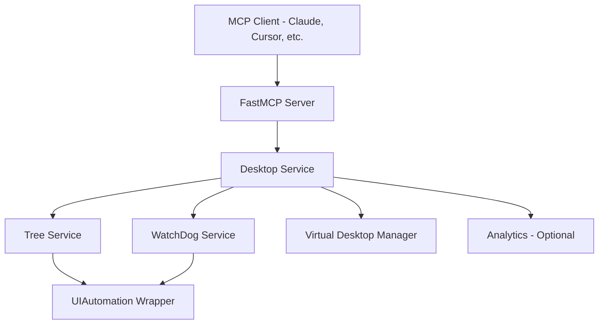

## What is Windows-MCP?

Windows-MCP is a Model Context Protocol (MCP) server that bridges the gap between large language models (LLMs) and the Windows operating system. It enables AI agents like Claude to perform direct desktop automation tasks including **file navigation, application control, UI interaction, QA testing**, and more.

Unlike traditional automation tools that rely on computer vision or specific fine-tuned models, Windows-MCP works with any LLM by exposing Windows accessibility APIs through a standardized MCP interface.

<Note>
Windows-MCP has reached **2M+ users** in Claude Desktop Extensions and is available in the [MCP Registry](https://github.com/modelcontextprotocol/registry).
</Note>

## Why Windows-MCP?

Windows-MCP solves a fundamental challenge: how can AI agents interact with desktop applications the same way humans do? By leveraging the Windows UIAutomation framework and exposing 16 powerful tools through the Model Context Protocol, Windows-MCP makes your desktop programmable by AI.

### Key Use Cases

<CardGroup cols={2}>
  <Card title="Desktop Automation" icon="robot">
    Automate repetitive tasks like data entry, form filling, and application management without writing code.
  </Card>
  <Card title="QA Testing" icon="vial">
    Perform comprehensive UI testing across Windows applications with natural language instructions.
  </Card>
  <Card title="System Administration" icon="screwdriver-wrench">
    Execute PowerShell commands, manage processes, modify registry keys, and automate system maintenance.
  </Card>
  <Card title="Web Scraping" icon="globe">
    Extract content from web pages with built-in DOM parsing and Markdown conversion.
  </Card>
</CardGroup>

## Key Features

### Seamless Windows Integration

Windows-MCP interacts natively with Windows UI elements using the UIAutomation framework. It can:
- Open and switch between applications
- Click buttons, fill text fields, and interact with menus
- Capture screenshots with bounding box annotations
- Detect interactive and scrollable elements with precise coordinates

### Works with Any LLM

No computer vision required. Windows-MCP extracts structured information from the Windows accessibility tree, making it compatible with any LLM - whether vision-enabled or text-only. This reduces complexity and eliminates the need for specialized models.

### Rich Toolset for Automation

Windows-MCP exposes 16 MCP tools covering:

<Steps>
  <Step title="Desktop State Inspection">
    The `Snapshot` tool captures complete desktop state including active windows, interactive elements, and optional screenshots with coordinate overlays.
  </Step>
  <Step title="User Input Simulation">
    Tools like `Click`, `Type`, `Scroll`, `Move`, and `Shortcut` enable precise mouse and keyboard control.
  </Step>
  <Step title="Application Management">
    The `App` tool launches applications, resizes windows, and switches focus between running programs.
  </Step>
  <Step title="System Operations">
    Execute PowerShell commands with `PowerShell`, manage files with `FileSystem`, control processes with `Process`, and modify registry with `Registry`.
  </Step>
</Steps>

### Real-Time Performance

Typical latency between actions ranges from **0.2 to 0.9 seconds**, depending on:
- Number of active applications
- System load and specifications
- LLM inference speed

This makes Windows-MCP suitable for interactive automation scenarios where responsiveness matters.

### Lightweight & Open-Source

Minimal dependencies with full source code available under the MIT license. The entire server is written in Python 3.13+ and uses:
- FastMCP for the MCP server implementation
- comtypes for Windows UIAutomation COM API access
- Pillow for screenshot capture and annotation
- psutil for process management

### Browser Automation with DOM Mode

Special `use_dom=True` mode in the `Snapshot` tool extracts web page content directly from browser DOMs (Chrome, Edge, Firefox), filtering out browser UI for cleaner web automation.

## Architecture Overview

Windows-MCP follows a layered service architecture:

- **FastMCP Server**: Entry point that registers all 16 tools
- **Desktop Service**: High-level orchestrator for window operations, screenshots, and input
- **Tree Service**: Captures Windows accessibility tree and identifies interactive elements
- **UIAutomation Wrapper**: Low-level abstraction over Windows COM APIs
- **WatchDog Service**: Monitors UI focus changes in real-time
- **Virtual Desktop Manager**: Tracks windows across Windows 10/11 virtual desktops

## Supported Platforms

<Info>
Windows-MCP supports **Windows 7, 8, 8.1, 10, and 11**.
</Info>

Requirements:
- Python 3.13 or higher
- UV package manager (recommended) or pip
- English as the default Windows language (preferred, or disable `App` tool for other languages)

## Supported MCP Clients

Windows-MCP works with any MCP-compatible client:

- **Claude Desktop** - Desktop app from Anthropic
- **Perplexity Desktop** - AI search with MCP support
- **Gemini CLI** - Google's command-line AI tool
- **Qwen Code** - Alibaba's coding assistant
- **Codex CLI** - OpenAI's command-line interface
- **Cursor** - AI-powered code editor

## Operating Modes

Windows-MCP supports two deployment modes:

### Local Mode (Default)

Runs directly on your Windows machine with direct access to the desktop environment. Ideal for personal use and development.

### Remote Mode

Connects to cloud-hosted Windows VMs through [windowsmcp.io](https://windowsmcp.io), enabling remote automation without local setup. Requires a Sandbox ID and API key from the dashboard.

<Warning>
Windows-MCP operates with **full system access** and can perform irreversible operations. Always review the [Security Policy](https://github.com/CursorTouch/Windows-MCP/blob/main/SECURITY.md) before deployment.
</Warning>

## What's Next?

Ready to get started? Follow our installation guide to set up Windows-MCP with your preferred MCP client.

<Card title="Installation Guide" icon="download" href="/installation">
  Install Windows-MCP in minutes with step-by-step instructions for all supported clients.
</Card>